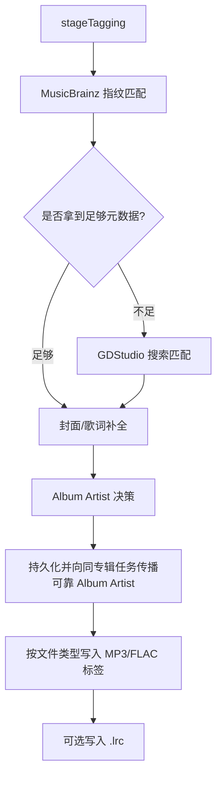

# 匹配与标签写入逻辑

本文档描述当前仓库里“曲目元数据匹配”“Album Artist 判定/共享”和“最终音频标签写入”的完整逻辑。

这三部分在代码里是串起来执行的，但职责不同：

- 匹配逻辑：决定标题、艺术家、专辑、封面、歌词、Album Artist、曲号等值从哪里来。
- 归并逻辑：决定 Album Artist 是否可信，是否可以复用同专辑其他任务的结果。
- 写入逻辑：把最终元数据写进 MP3/FLAC 标签。

## 1. 入口与总流程

主入口在 `internal/worker/download_task.go` 的 `stageTagging(...)`。

执行顺序如下：

## 2. 第一层匹配：MusicBrainz 指纹优先

### 2.1 调用位置

- `internal/worker/download_task.go`
  - 先调用 `LookupTrackMetadataByFingerprint(job.FilePath)`
  - 如果失败或无结果，再调用 `LookupTrackMetadata(job.Title, job.Artist, job.Album)`

设计意图是：

1. 已经下载到本地文件后，优先用音频内容本身做指纹识别。
2. 指纹失败时，再退回到标题/艺术家/专辑的文本检索。

### 2.2 指纹匹配链路

`LookupTrackMetadataByFingerprint(...)` 位于 `internal/service/musicbrainz/musicbrainz.go`。

它的处理顺序是：

1. 用 `fpcalc` 生成音频指纹。
2. 调 AcoustID `/lookup`。
3. 从 AcoustID 返回结果中取 `score` 最高的一条 recording。
4. 再用 MusicBrainz 的 recording 搜索补全真正元数据。
5. 从匹配到的 release / release-group 继续补专辑、发行日期、Album Artist、封面、曲号、碟号。

### 2.3 AcoustID 的选择规则

AcoustID 返回多个结果时，当前实现只做一件事：

- 取 `item.Score` 最大的一项。
- 每项里如果有 `Recordings`，默认使用第一条 recording。

也就是说，AcoustID 阶段本身没有复杂二次评分，复杂评分发生在后续 MusicBrainz 搜索阶段。

### 2.4 MusicBrainz recording 评分规则

函数：`pickBestRecording(...)`

评分项如下：

- `+100`：`recordingID` 精确相等
- `+30`：标题标准化后完全相等
- `+20`：艺术家部分匹配
  - 规则是 `artistMatches(left, right)`
  - 本质是双方转小写、去首尾空格后做互相 `contains`
- `+20`：release-group id 命中
- `+10`：release 标题命中 `albumHint`

最终选择总分最高的 recording。

### 2.5 MusicBrainz release 评分规则

函数：`pickBestRelease(...)`

评分项如下：

- `+100`：`releaseGroupID` 精确相等
- `+40`：专辑名标准化后完全相等
- `+10`：`status == official`
- `+5`：发行日期可解析出年份

最终选择总分最高的 release。

### 2.6 指纹匹配得到的元数据如何落到任务

函数：`applyFingerprintMetadata(...)`

规则是“有值就覆盖”：

- `Title` 有值就覆盖任务标题
- `Artist` 有值就覆盖任务艺术家
- `AlbumArtist` 有值就覆盖任务专辑艺术家，并同步写入 `AlbumArtistSource`
- `Album` 有值就覆盖任务专辑
- `TrackNumber` 大于 0 才覆盖
- `Year` 大于 0 才覆盖

这里说明当前系统对 MusicBrainz 指纹结果的信任等级很高，甚至允许它覆盖源站返回的标题和艺术家。

## 3. 第二层匹配：MusicBrainz 文本搜索补全

### 3.1 触发时机

如果指纹匹配失败或没有拿到结果，就调用：

- `LookupTrackMetadata(title, artist, album)`

### 3.2 搜索策略

当前实现是“先按专辑，再按 recording”：

1. 如果有 `album`，先走 `lookupTrackMetadataByRelease(...)`
2. 如果 release 路径没拿到结果，再按 recording 搜索

### 3.3 release 匹配规则

函数：`pickBestReleaseForAlbumArtist(...)`

评分项如下：

- `+80`：专辑名标准化后完全相等
- `+10`：`status == official`
- `+5`：release artist-credit 与 artist hint 部分匹配
- `+1`：发行日期可解析出年份

拿到最佳 release 后，再请求 release detail，继续从 track 列表里找最像当前曲目的 track。

### 3.4 release detail 中 track 的评分规则

函数：`scoreReleaseDetailTrack(...)`

评分分三层：

- 标题标准化后完全相等：`+100`
- 标题做“弱标准化”后相等：`+70`
  - 会去掉空格、波浪线、冒号、连字符、括号、书名号中括号、点号等差异
- 标题 token 重合：每个共享 token `+15`
- 艺术家部分匹配：`+10`

如果最佳分数 `<= 0`，认为没有合适 track，不使用该结果。

### 3.5 标题标准化的真实含义

当前仓库里存在两级标准化：

- `normalize(...)`
  - 仅做 `TrimSpace + ToLower`
- `normalizedComparableTitle(...)`
  - 在 `normalize(...)` 基础上再移除空格、括号、冒号、波浪线、连字符等视觉差异字符

这意味着它能把下面这些标题视为高度接近：

- `决行 〜姫をさがして：黄金〜`
- `決行～姫をさがして:黄金～`

## 4. 第三层匹配：GDStudio 搜索兜底

### 4.1 触发条件

函数：`shouldResolveGDMetadata(...)`

只要 `brainzMeta == nil`，一定会走 GDStudio 搜索。

即使已经拿到了 `brainzMeta`，只要下面任一字段仍然缺失，也会继续补 GDStudio：

- `job.Title == ""`
- `job.Artist == ""`
- `job.Album == ""`
- `job.TrackNumber == 0`
- `job.Year == 0`
- `coverID == ""`
- `coverID == trackID`
- `lyricID == ""`
- `lyricID == trackID`

这里的含义不是“MusicBrainz 不可信”，而是“MusicBrainz 只负责尽量补全，源站仍然可能提供更适合下载场景的 `pic_id` / `lyric_id`”。

### 4.2 GDStudio 的搜索关键词生成

函数：`buildSearchKeywords(trackID, title, artist)`

生成顺序固定：

1. `title + " " + firstArtist`
2. `title`
3. `trackID`

其中 `firstArtist` 的提取会按以下分隔符截断：

- `/`
- `,`
- `;`
- `、`

并且会去重，空值不会加入。

因此多人歌手时，系统优先搜索“标题 + 第一艺术家”，而不是完整 artist 串。

### 4.3 GDStudio 的命中规则

函数：`pickMetadata(...)`

GDStudio 搜索结果不会直接拿第一条，而是按以下顺序筛：

#### 第一步：`track_id` 精确匹配

- 遍历返回 items
- 只有当 `item["id"] == trackID` 才接受
- 命中后立即返回

这一步优先级最高。

#### 第二步：标题完全相等 + 艺术家部分匹配

仅当第一步失配时进入：

- 标题必须 `EqualFold(trim(name), trim(title))`
- 如果调用方提供了 artist，则还会校验艺术家

艺术家校验规则：

1. 先读 `item["artist"]`
2. 如果为空，尝试把它当嵌套 artist 列表取第一项名称
3. 如果拿到了 `itemArtist`，就要求它与请求侧 artist 至少部分包含

即：

- `contains(lower(itemArtist), lower(normalizedArtist))`
- 或 `contains(lower(normalizedArtist), lower(itemArtist))`

只要两者都不满足，就丢弃该搜索结果。

### 4.4 明确禁止的旧行为

当前实现有一个关键保护：

- 不再“盲目返回第一条带 `pic_id` 的结果”

代码里专门写了注释说明这一点，目的很明确：

- 避免同名歌曲把别的歌的封面匹配进来。

这也是当前文档里最需要强调的安全约束之一。

### 4.5 GDStudio 元数据如何应用到任务

函数：`applyGDMetadata(...)`

规则是“只补空，不覆盖已有值”：

- `job.Title == ""` 才写标题
- `job.Artist == ""` 才写艺术家
- `job.Album == ""` 才写专辑
- `job.TrackNumber == 0` 才写曲号
- `job.Year == 0` 才写年份

这和 `applyFingerprintMetadata(...)` 不同。

差异可以概括为：

- MusicBrainz 指纹结果：可以覆盖
- GDStudio 搜索结果：只做补空

## 5. 封面和歌词匹配逻辑

### 5.1 封面优先级

封面来源优先级如下：

1. MusicBrainz `Cover Art Archive`
2. GDStudio `ResolveCover(...)`

具体决策：

- 如果 `brainzMeta` 已经带回 `CoverData`，优先直接使用
- 如果没有封面数据，再决定 `resolvedCoverID`

`resolvedCoverID` 的选取顺序：

1. 当前 `coverID`
2. `gdMeta.PicID`
3. `payload.TrackID`

### 5.2 GDStudio 封面解析策略

`ResolveCover(...)` 会按尺寸回退：

- `1000`
- `640`
- `500`
- `300`

只要有一个尺寸成功拿到 URL，就继续下载图片二进制。

### 5.3 歌词匹配逻辑

歌词没有复杂搜索评分，直接按 `lyricID` 解析：

- 如果 `payload.LyricID` 为空，先回退到 `payload.TrackID`
- GDStudio 元数据返回了新的 `LyricID` 时，允许覆盖默认值
- 最终调用 `ResolveLyrics(source, lyricID)` 获取：
  - 原文歌词
  - 翻译歌词

## 6. Album Artist 决策逻辑

Album Artist 是当前实现里最复杂的“标签匹配”部分，因为它不仅依赖当前曲目，还会跨任务共享。

### 6.1 可靠来源定义

`internal/model/job.go` 里把来源分成两类。

可靠来源：

- `fingerprint`
- `musicbrainz`
- `album_shared`

弱来源：

- `fallback_first_artist`
- `fallback_artist`

### 6.2 决策顺序

函数：`determineAlbumArtist(...)`

顺序如下：

1. 当前任务已有可靠 `AlbumArtist`，直接用
2. 查同来源、同库、同专辑的其他任务是否已有可靠 `AlbumArtist`
3. 仍没有，再调 `resolveAlbumArtist(...)`

### 6.3 同专辑共享规则

仓库查询函数：`FindReliableAlbumArtist(...)`

过滤条件：

- `source` 相同
- `library_id` 相同
- `album` 去空格并转小写后相同
- `album_artist <> ''`
- `album_artist_source` 必须属于可靠来源
- 可排除当前任务 `excludeID`

排序优先级：

1. `fingerprint`
2. `musicbrainz`
3. `album_shared`
4. 同优先级下 `updated_at DESC`

也就是说，同专辑任务之间共享 Album Artist 时，明确更信任指纹结果，其次是 MusicBrainz 文本结果。

### 6.4 共享回填规则

当当前任务最终拿到了可靠 Album Artist 后，会调用：

- `PropagateReliableAlbumArtist(...)`

回填范围：

- 同来源
- 同库
- 同专辑
- 状态仍未完成的任务
- 这些任务当前没有 Album Artist，或者 Album Artist 来源不是可靠来源

回填后的来源被标记为：

- `album_shared`

### 6.5 Album Artist 最终兜底

函数：`resolveAlbumArtist(title, artist, album)`

顺序如下：

1. 先调 `MusicBrainz.LookupAlbumArtist(...)`
2. 如果失败，再从 `Artist` 中提取第一艺术家
3. 如果本来就是单人 artist，则直接返回原 artist

#### MusicBrainz.LookupAlbumArtist 的顺序

1. 如果有标题：
   - 搜索 `recording:"title"`
   - 有 artist 时再附加 `AND artist:"第一艺术家"`
   - 用 `extractAlbumArtist(...)` 从 recording -> release artist-credit 中抽 Album Artist
2. 如果上一步没拿到且有 album：
   - 搜索 `release:"album"`
   - 通过 `pickBestReleaseForAlbumArtist(...)` 找最合适 release
   - 直接返回该 release 的 artist-credit

#### 第一艺术家的提取规则

函数：`extractFirstArtist(...)`

按以下分隔符从左到右截断：

- `" / "`
- `"/"`
- `","`
- `";"`
- `"、"`

例如：

- `植松伸夫 / 矢崎早彩` -> `植松伸夫`
- `塞壬唱片-MSR / Elvin Shen / ZT` -> `塞壬唱片-MSR`

## 7. 最终标签写入逻辑

真正写标签的入口在 `internal/service/tagger/tagger.go`：

- `.mp3` -> `WriteMP3TagsWithID3v2(...)`
- `.flac` -> `writeFLACTags(...)`

### 7.1 多艺术家拆分规则

函数：`splitArtistValues(...)`

支持的分隔符：

- `" / "`
- `"; "`
- `" feat. "`
- `" ft. "`
- `" featuring "`
- `"、"`

注意：

- 使用的是明确分隔符，而不是任意 `/`
- 所以 `AC/DC` 不会被拆开
- 结果会去重、去空格、去掉 `\x00`

### 7.2 MP3 写入规则

文件：`internal/service/tagger/mp3.go`

核心行为：

- ID3 版本固定设为 `v2.4`
- `Title` -> 标题
- `Album` -> 专辑
- `Artist`：
  - 先删除旧 Artist frame
  - 再写入新 frame
  - 多值使用 `\x00` 分隔
- `AlbumArtist`：
  - 写入 `TPE2`
  - 也是先删旧值再写新值
  - 多值同样用 `\x00`
- `TrackNumber` -> 曲号
- `DiscNumber` -> 碟号
- `Year` -> 年份
- `Date` -> Recording time
- `Genre` -> Content type
- `Composer` -> Composer
- `Label` -> Publisher
- `Comment` -> Comment frame
- MusicBrainz ids / 翻译歌词 -> User defined text frame
- 封面 -> APIC
- 歌词 -> UnsynchronisedLyricsFrame

### 7.3 FLAC 写入规则

文件：`internal/service/tagger/flac.go`

核心行为：

1. 先删除当前任务会覆盖的 tag，避免重复值累积
2. 再逐项写入新 tag
3. 如果有封面：
   - 先删旧 `PICTURE`
   - 再导入新封面

FLAC 对多值的处理与 MP3 不同：

- `ARTIST` / `ALBUMARTIST` 写单值原串
- `ARTISTS` / `ALBUMARTISTS` 写重复 tag
  - 例如 `Artist A / Artist B`
  - 会写成两条 `ARTISTS=Artist A`、`ARTISTS=Artist B`

这说明当前实现是同时保留：

- 单值兼容字段
- 多值语义字段

### 7.4 标签写入失败的处理策略

标签写入失败不是致命错误：

- `WriteTags(...)` 失败只记录 warning
- 任务仍继续往后走

歌词 sidecar `.lrc` 的写入也是同样策略：

- 失败只记 warning，不中断任务

## 8. 当前逻辑里的关键设计原则

可以把整个系统概括为下面几个原则：

### 8.1 指纹高于搜索

- 能靠音频内容识别，就优先信任指纹链路
- 指纹结果允许覆盖原有标题/艺术家

### 8.2 精确 id 高于文本近似

- GDStudio 搜索先看 `track_id`
- 只有 `track_id` 不命中时才退化到标题/艺术家

### 8.3 文本近似必须带约束

- 标题必须精确相等
- 艺术家至少部分匹配
- 不允许“第一条结果就拿来用”

### 8.4 专辑级信息优先于单曲级回退

- `AlbumArtist` 有可靠来源时，优先级高于“从当前曲目的 artist 拆第一人”
- 同专辑任务之间共享可靠 Album Artist，避免一张专辑每首歌各自回退出不同目录

### 8.5 写标签前允许多源融合

最终落盘标签不是单一来源，而是融合结果：

- MusicBrainz 给结构化元数据、发行信息、封面
- GDStudio 给源站侧 `pic_id` / `lyric_id` 和补空元数据
- Album Artist 再经过专辑级共享与回退

## 9. 测试覆盖到的关键点

当前已有测试覆盖了几条关键约束：

- `internal/service/gdstudio/client_test.go`
  - `pickMetadata(...)` 优先精确 `track_id`
- `internal/service/musicbrainz/musicbrainz_test.go`
  - Album Artist 可从 release artist-credit 回退获得
  - release detail 可补齐标题、艺术家、曲号、日期、MusicBrainz ids
- `internal/worker/download_task_test.go`
  - 可靠 Album Artist 优先于共享值
  - 弱来源可被同专辑共享值替换
  - Album Artist 可退化为 `Artist` 的第一人
  - 指纹元数据会保留其来源标记
- `internal/service/tagger/artist_values_test.go`
  - 多艺术家拆分规则
  - `AC/DC` 不会被错误拆分
  - MP3/FLAC 多值写法符合当前实现

## 10. 一句话总结

当前仓库的“匹配标签逻辑”不是单点规则，而是一个有明确优先级的多源融合流程：

- 先用 MusicBrainz 指纹拿高置信元数据
- 不足时用 GDStudio 搜索补空和反查封面/歌词 ID
- 再把 Album Artist 提升到专辑维度统一
- 最后按 MP3/FLAC 各自规范写入标签

如果后续要改行为，最容易引发错误匹配的点主要有三个：

- 放宽 GDStudio 标题/艺术家筛选
- 恢复“盲目取第一条搜索结果”
- 让弱来源 Album Artist 覆盖可靠来源
